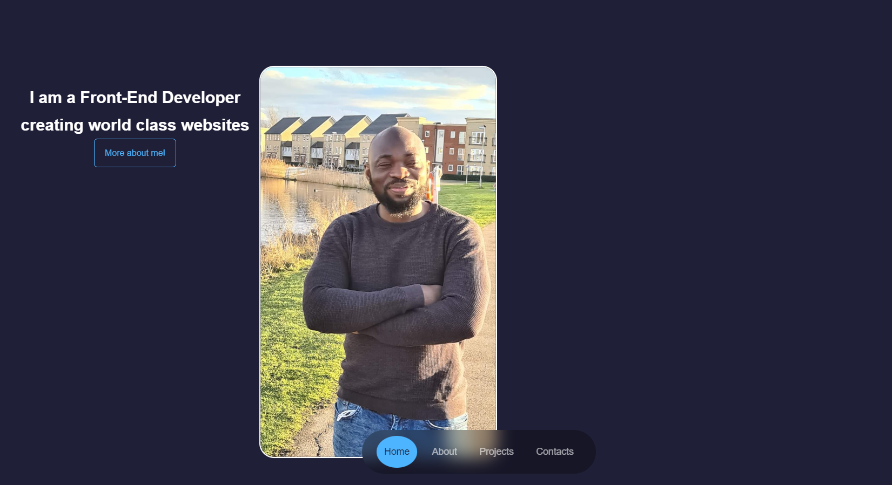
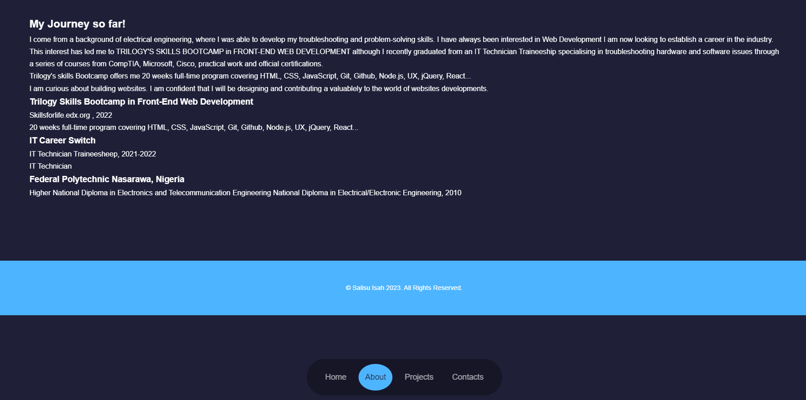
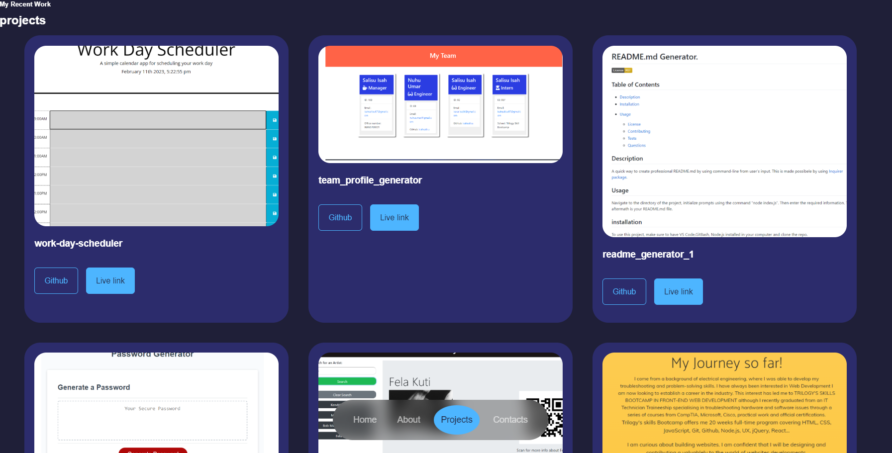
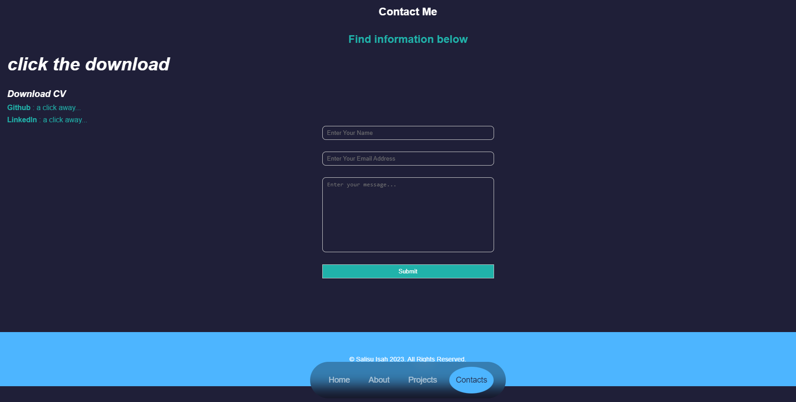

# my_portfolio_react
Welcome to My Portfolio React! This is a project that showcases a personal portfolio website built with React, designed to showcase my skills, projects, and experiences.

## Table of Contents
* Installation
* Usage
* Contributing
* License

### Table of Contents
- [Installation](#installation)
- [Usage](#usage)
- [Contributing](#contributing)
- [License](#license)

## Installation

To get started with this project, follow these steps:

- Clone this repository to your local machine
- Install the required dependencies by running `npm install`
- Run the project with `npm start`
- Open your web browser and navigate to `http://localhost:3000.`

## Usage
Once you have the project running, you can navigate through the various pages of the portfolio website to view information about the owner's skills, projects, and experiences.

The project is designed to be easily customizable, so feel free to edit the source code and add your own information and projects to the portfolio.

## Contributing
If you would like to contribute to this project, please follow these steps:

- Fork this repository
- Create a new branch for your changes
- Make your changes and commit them to your branch
- Submit a pull request to this repository
- Please note that all contributions are subject to review and approval by the project maintainers.

# License
 MIT License 

